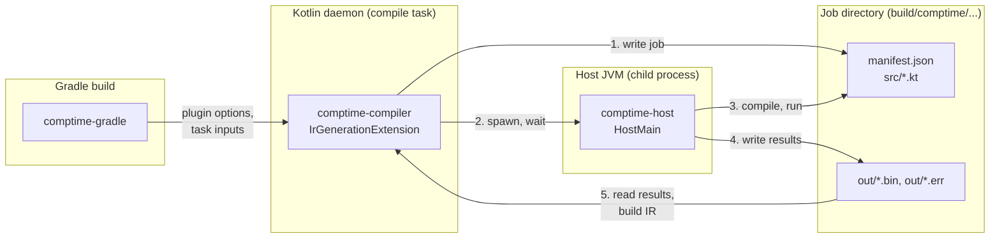

# comptime for Kotlin — Plan & Spec

Sep 29, 2026 · @Jack Scott · revised the same day after review (see [Revision notes](#revision-notes))

Target toolchain: Kotlin 2.4.20 (latest stable at time of writing), K2, Gradle. Package, Maven group and Gradle plugin ID: `dev.ujhhgtg.comptime`. Statements marked ✓ were checked against the Kotlin 2.4.20 compiler and Kotlin Gradle plugin sources.

**Status:** all five phases are implemented and tested. The spike's answers are in [spike.md](spike.md), and what implementing phases 3–5 changed is under [Implementation notes (phases 3–5)](#implementation-notes-phases-35).

## Overview

`comptime { ... }` runs a block of Kotlin at build time on a desktop JDK and bakes its result into the compiled code. Think Rust's `build.rs`, but inline at the call site.

```kotlin
val crc8Table: List<Int> = comptime {
    (0 until 256).map { n ->
        var c = n
        repeat(8) { c = if (c and 0x80 != 0) (c shl 1) xor 0x07 else c shl 1 }
        c and 0xFF
    }
}
val schema: String = comptime { java.io.File("schema.sql").readText() }
```

The design in one paragraph: a Kotlin IR compiler plugin finds every `comptime` call and checks that each block references only the JDK, kotlin-stdlib, constants, and its own locals. It cuts each block's source text out of the file, writes the compiler's already-folded constants back in as literals, and hands all blocks to a separate host JVM process. The host compiles the blocks against only the JDK and kotlin-stdlib, runs each in an isolated classloader, and returns the results as bytes. The plugin then replaces each call with IR that produces the value: an inline constant for scalars and strings, a synthetic holder built once for collections.

Motivation: fun, novelty, and doing it because it's possible. A Gradle codegen task could do more, and that's deliberately not the point.

## Scope and non-goals

Phase 1 targets Kotlin/JVM modules only, built with Gradle and the K2 compiler.

| In scope | Out of scope |
| --- | --- |
| Kotlin/JVM modules | Kotlin Multiplatform, JS, Native |
| JDK + kotlin-stdlib APIs inside blocks | Third-party libraries inside blocks |
| Kotlin `const val` and Java compile-time `static final` constants (any module) | Any other project API |
| Primitives, strings, Kotlin collections as results | Project types, JDK types, lookup tables of your own classes |
| Plain `val x = comptime { }` | `const val x = comptime { }`, annotation arguments |
| Build-time errors only | FIR checker, IDE highlighting, inlay hints of evaluated values |
| File and env input tracking | Sandboxing (no SecurityManager since JDK 24) |

Android source sets are expected to work the same way as JVM, with one known limit: blocks are type-checked against `android.jar`, so desktop-only APIs such as `java.awt` won't resolve there. Android compiles use `-no-jdk`, so the host runs on the daemon's JDK unless one is pinned. It gets tested after JVM works but isn't a phase 1 target.

## User-facing semantics

A block is an ordinary lambda with no receiver. It is evaluated once per call site per build, and its value is baked in.

```kotlin
// comptime-runtime, package dev.ujhhgtg.comptime
fun <T> comptime(block: () -> T): T =
    error("comptime plugin not applied")
```

The function is deliberately not `inline`, so the call and its lambda survive until the IR pass. If the plugin is missing, the call throws at runtime, loudly.

### Block shape

- The argument must be a lambda literal, optionally labelled (`comptime lbl@{ ... }`). A function reference, a variable holding a lambda, or an anonymous `fun() { }` is a compile error.
- The callee must be written `comptime` or fully qualified. Calling through an import alias (`import dev.ujhhgtg.comptime.comptime as ct`) is a compile error in phase 1, because the host's shadow function is what provides the `@comptime` label.
- A `comptime` call nested inside a block is not collected separately. It runs as part of the outer block in the host, through the shadow function.

### What a block may reference

- **Allowed:** anything in the JDK, kotlin-stdlib, declarations made inside the block itself, and `const val`s and Java compile-time constants from the current module or its dependencies.
- **Forbidden:** every other project or library declaration (classes, functions, non-const properties, types), captured locals and parameters, and an outer `this`, including implicit-receiver calls.

Enforcement is layered. The plugin's IR reference check (see [Reference check](#reference-check)) rejects forbidden references at their exact location before anything runs. The host compile is the backstop: whatever slips past the check fails to resolve there.

Blocks are type-checked twice: by the main compile against the module's classpath and JDK, then by the host against JDK + stdlib. A block can only use APIs present in both the module's compile JDK and the host JDK.

### Result types

The contract is the call's inferred type `T` (the type of the `comptime` call), not the declared type of whatever it's assigned to. `T` must be built only from:

- `Boolean`, `Byte`, `Short`, `Int`, `Long`, `Float`, `Double`, `Char`, `String`, `UByte`, `UShort`, `UInt`, `ULong`.
- `List<T>`, `Set<T>`, `Map<K, V>`, `Array<T>`, and the primitive arrays (`IntArray` and friends), nested arbitrarily. Unsigned arrays (`UIntArray` and friends, still experimental) are not supported.
- Nullable versions of any of the above.
- `Unit`, for side-effect blocks such as validating a file and failing the build.

A call typed `List<Any>`, `Number` or `Nothing` is a compile error. Java platform types are accepted: unknown nullability counts as nullable, and unknown mutability as read-only, so `Files.readAllLines(p)` is treated as `List<String?>?`. At runtime, the host checks actual values against `T`.

### How values are baked

| Result | At runtime |
| --- | --- |
| Scalars, `String`, `null`, `Unit` | An inline constant at the call site. |
| Collections with no arrays anywhere inside | Built once, on first use, in a synthetic holder. Every evaluation of that call site returns the same instance. |
| Anything containing an array | Built fresh on every evaluation, like the source expression would be. Arrays are mutable, so sharing one would leak mutations between evaluations. |
| Any call site inside a non-private `inline` function | Built in place on every evaluation. The body is copied into other modules, which can't reach private synthetic declarations. |

Collections are read-only by static type (`listOf`, `setOf`, `mapOf`); `Set` and `Map` keep iteration order. As with any Kotlin read-only collection, a cast can still mutate the runtime object, and for a cached value that mutation would be shared.

### Execution rules

- **Where:** a separate JVM process. It runs on the JDK pinned in the build script, else on the module's compile JDK (`-jdk-home`), else, for `-no-jdk` compiles such as Android, on the Kotlin daemon's JDK.
- **Working directory:** the module directory, so `File("data.json")` resolves relative to the module.
- **Environment:** the Kotlin daemon's environment, with every declared env var forced to its current value, or removed if it is unset. Undeclared variables are whatever the daemon started with and may be stale.
- **Isolation:** each block gets a fresh classloader. Static state never leaks between blocks.
- **Order:** undefined, but one block at a time. Each call site runs exactly once, with no deduplication of identical blocks.
- **Failure:** any exception, timeout, `System.exit`, or type mismatch is a compile error at the call site.
- **Output:** stdout and stderr are captured. Phase 1 shows them only when a block fails.
- **Semantics:** values are computed with JVM rules. Inside a public inline function, the value freezes at the library's build time.

## Architecture

The system is four modules: `comptime-runtime` (the `comptime` function), `comptime-compiler` (the IR plugin), `comptime-host` (the standalone runner), and `comptime-gradle` (the Gradle plugin).



The Gradle plugin configures the IR plugin. The IR plugin writes one job per module, the host compiles and runs it, and the IR plugin reads the results back to build the values.

## Compiler plugin

The compiler plugin is IR-only in phase 1: a `CommandLineProcessor` for options, a `CompilerPluginRegistrar` with `supportsK2 = true`, and one `IrGenerationExtension`. There is no FIR extension.

### Pass structure

The extension runs after fir2ir and before any lowering or inlining. By then the compiler has already replaced const reads with literals (see [Const splicing](#const-splicing)). Per module it runs three stages:

1. **Collect.** Visit every file, find calls whose callee is `dev.ujhhgtg.comptime.comptime`, and skip calls nested inside another block. Record for each: file path, lambda offsets, the call's `IrType`, the inlined constants inside the lambda, and every symbol it references.
2. **Check.** Validate block shape, result type and references. Blocks that fail are reported here and never reach the host.
3. **Evaluate and replace.** Send all valid blocks to the host in one job, wait, then replace each call with the IR built from its result.

One job per module keeps the host's compile cost to a single run.

### Reference check

Walk each lambda's IR:

- Every referenced symbol (calls, constructor calls, property and field access, object and enum references, callable references, class literals) and every type classifier (variable types, type arguments, casts) must be one of:
  - declared inside the lambda, or
  - external (not part of the module being compiled) and in package `kotlin`, `java`, `javax` or `jdk`, or a subpackage. IR builtins live in `kotlin.internal.ir`, so they pass.
- An `IrGetValue` of a variable, parameter or receiver declared outside the lambda is a captured local or an outer `this`: an error.
- Inlined constants carry no symbol, so they pass.

Errors point at the offending reference in the original file.

The check closes a hole that the host compile alone leaves open. Dropping a project import, or moving the block into another package, can make a name silently resolve to a different stdlib or JDK declaration instead of failing:

- `import com.app.util.listOf` is dropped, so the host uses `kotlin.collections.listOf`.
- The file imports `java.io.*` and its package has its own `class File`: the host picks `java.io.File`.
- A captured local `val PI` in a file that imports `kotlin.math.PI`: the host picks `kotlin.math.PI`.

Libraries that share those package prefixes (`javax.inject`, `kotlin-test`, `kotlin-reflect`) pass the check and then fail to resolve in the host. That failure is loud, so it's acceptable.

One gap remains: IR has no typealias information in 2.4.20, so a project typealias is checked as the type it expands to. If its name also names a different stdlib or JDK type, the host resolves that other type silently.

### Block extraction

The block's text comes from the original file on disk (`IrFile.fileEntry.name`). Before slicing, the text is decoded as UTF-8 and line endings are normalized (CRLF and lone CR to LF), exactly as the compiler does before computing offsets ✓. A BOM is kept: the compiler counts it as one character. IR offsets are UTF-16 char offsets into that normalized text.

The slice is the whole lambda argument: braces included, and its label if it has one. The `IrFunctionExpression` span covers the braces but not the label (spike), so the label is taken from the call text between the callee and the lambda. The same check rejects callees that aren't spelled `comptime` or fully qualified.

### Const splicing

- **Finding reads ✓:** right before IR extensions run, `Fir2IrPipeline` runs `ConstInliner`. It replaces every read of a `const val` (same module or not) and of a Java compile-time `static final` with a copy of the field's initializer `IrConst`, keeps the offsets of the original read, and sets `IrConst.wasInlined = true`. So every `IrConst` in the lambda with `wasInlined == true` is a splice site, and its value comes with it.
- **Fallback:** `wasInlined` is compiler-internal. If it disappears, treat any `IrConst` whose source text isn't a literal token as a splice site.
- **Receivers:** a read through an expression receiver becomes `IrComposite(receiver, const)`. It's rare, and phase 1 reports it as unsupported.
- **Rendering:** every rendering is wrapped in parentheses, so `x-FOO` can't become `x--1`.

  | Value | Rendered as |
  | --- | --- |
  | `Boolean`, `Int`, `Long` | `true`, `42`, `42L`; `Int.MIN_VALUE` as `(-2147483647 - 1)` and `Long.MIN_VALUE` as `(-9223372036854775807L - 1L)`, which have no literal |
  | `Byte`, `Short` | `(42).toByte()`, `(42).toShort()`: there is no suffix, and a bare `42` is an `Int` that would change inference |
  | `UByte`, `UShort`, `UInt`, `ULong` | `42u.toUByte()`, `42u.toUShort()`, `42u`, `42uL` |
  | `Float`, `Double` | `1.5f`, `1.5` when finite and `toString()` round-trips; otherwise `Float.fromBits(...)`, `Double.fromBits(...)` (NaN, ±∞) |
  | `Char`, `String` | `'a'`, `"..."` with `\\`, `\"`, `\'`, `\$` and control characters escaped, other non-printables as `\uXXXX` |

- **String templates:** `$FOO` becomes `${...}` and `${FOO}` becomes `${...}`. Multi-dollar strings (`$$"..."`) interpolate with `$$FOO`, so the splicer reads the actual interpolation prefix before the span instead of assuming a single `$`.
- **Qualified reads:** an inlined const keeps only the selector's offsets (`MIN_VALUE` in `Int.MIN_VALUE`, found in the spike), so the splicer walks back over the qualifier chain (`Obj.`, `pkg.Obj.`, `Outer.Companion.`) and replaces it too.
- **Splice order:** from the last offset to the first, so earlier offsets stay valid.

### Import filtering

The synthetic file copies only the imports the block uses. An explicit import (aliases included) is kept if it names a symbol the reference check saw, or the class containing one. A star import is kept if its package contains one. Typealias abbreviations count as references. Everything else is dropped. Imports are parsed from the file header text.

Copying unused imports would be dangerous: Kotlin rejects an unresolved import even when nothing uses it, and all blocks compile in one call. A single `import javax.inject.Inject` in any file with a block would break every block in the module.

### Synthetic file shape

```kotlin
package comptimegen.b7

import java.io.File                                     // only imports the block uses

private fun <T> comptime(b: () -> T): T = b()           // provides the @comptime label

fun comptimeEntry(): ByteArray = comptimegen.enc.encode(
    "L<S>",                                             // type descriptor, see Encoding
    comptime<kotlin.collections.List<kotlin.String>> { /* original lambda, consts spliced */ }
)
```

- Each block gets its own package, so names never clash.
- The shadowing `comptime` means the lambda pastes in unchanged, labels included.
- The shadow is not `inline`, matching the runtime declaration, so the host accepts exactly the control flow the main compile accepted.
- The type argument is the call's `IrType` rendered as fully qualified Kotlin source.
- The entry point has an unlikely name, so it doesn't shadow `kotlin.run` or anything else a block might call.
- `encode` is a generated encoder, described under [Result encoding](#result-encoding-and-ir-embedding).

## Host process and protocol

The host is a standalone JVM program that the plugin always runs as a child process, even when no JDK is pinned. A child process gives killable timeouts, protection against `System.exit`, and one code path for every JDK choice.

Since phase 5, the plugin compiles the blocks itself, in-process, with the same `BlockCompiler` the host has (shared as source), against the host JDK's `-jdk-home`. The Kotlin daemon is warm and a fresh host JVM isn't, so this removes most of a job's cost. The manifest then says `precompiled` and the host only runs the blocks. If the in-process compile fails for any reason other than errors in the blocks, the host compiles as before; `inProcessCompile=false` forces that.

### Launch

```
<jdk>/bin/java -cp <host.jar + kotlin-compiler-embeddable deps> \
    dev.ujhhgtg.comptime.host.HostMain <job-dir>
```

- **JDK:** the pinned JDK's `java`; else `JVMConfigurationKeys.JDK_HOME`, the `-jdk-home` that KGP sets from the compile task's toolchain ✓, so blocks run on the JDK they were type-checked against; else, under `-no-jdk`, the daemon's own `System.getProperty("java.home")`.
- **Working directory:** the module directory.
- **Environment:** inherited from the daemon, with each declared variable set explicitly on `ProcessBuilder.environment()`, or removed if it is unset. The Kotlin daemon is long-lived and never refreshes its environment, so without this a changed `BUILD_FLAVOR` would rerun the task and still bake the old value.
- **Compiler version:** the host bundles `kotlin-compiler-embeddable` at the same version the plugin is built against. The plugin is version-locked anyway.
- **Stdlib:** the module's own kotlin-stdlib jar, the one the main compile checked blocks against. The plugin finds it on the compile classpath itself.

### Job directory

The protocol is plain files in a job directory under `build/comptime/<compilation>/`. It's easy to debug: a failed job can be rerun by hand.

```
job/
  manifest.json      per block: id, original file, offsets, line/column mapping, type descriptor;
                     timeout, stdlib path, language settings
  src/b0.kt ...      one synthetic file per block
  src/encoder.kt     shared result encoder
  classes/           compile output (plugin or host)
  out/compile.json   compile diagnostics, if any: file, line, column, severity, message
  out/b0.started     written just before block 0 runs
  out/b0.bin         encoded result, or
  out/b0.err         error kind + message + stack trace + captured stdout/stderr
  out/b0.out         captured stdout/stderr of a block that succeeded, if it printed anything
```

### Host steps

1. Unless the manifest says `precompiled`, compile everything in `src/` with one programmatic `K2JVMCompiler` call and a custom `MessageCollector`, using:
   - `-no-stdlib`, `-no-reflect` and `-nowarn`, with the stdlib jar explicitly on the classpath, and `-jdk-home` set to the host's own JDK;
   - the module's language version and enabled language features, read from its `LanguageVersionSettings`;
   - opt-in to every stdlib opt-in marker, since the main compile already enforced opt-ins;
   - never `-Werror`.

   Diagnostics go to `out/compile.json` with synthetic positions.
2. For each block, create a `URLClassLoader` holding only the stdlib jar and `classes/`, with `ClassLoader.getPlatformClassLoader()` as parent.
3. Write `out/bN.started`, then call `comptimegen.bN`'s `comptimeEntry()` reflectively on a worker thread, capturing `System.out` and `System.err`. Swapping the global streams is safe because blocks run one at a time.
4. Write `out/bN.bin` on success (plus `out/bN.out` if the block printed anything), or `out/bN.err` on failure.
5. Once every block has an output file, flush and call `Runtime.getRuntime().halt(0)`, so threads or shutdown hooks left behind by blocks can't keep the host alive.

The plugin enforces the timeout on the whole process, host compile included, and kills it on expiry. A block with a `.started` marker but no output is reported as the one that timed out, crashed, or called `System.exit`. Blocks without a marker are reported as never run.

## Result encoding and IR embedding

Results cross from the block's classloader to the host as a `ByteArray` only. Each classloader has its own stdlib copy, so a `kotlin.UInt` from a block is a different class than the host's; bytes sidestep that entirely.

### Encoding

The encoder is compiled into the same unit as the blocks and uses only `java.io.DataOutputStream`. The format is a tagged tree:

| Tag | Payload |
| --- | --- |
| `NULL` | none |
| `BOOL`, `BYTE`, `SHORT`, `INT`, `LONG`, `FLOAT`, `DOUBLE`, `CHAR` | the value |
| `UBYTE`, `USHORT`, `UINT`, `ULONG` | the underlying signed bits |
| `STRING` | length + UTF-16 code units (`writeChars`). UTF-8 would turn unpaired surrogates into `?`, and `writeUTF` caps at 64 KB. |
| `LIST`, `SET`, `ARRAY` | size + elements |
| `INT_ARRAY` and other primitive arrays | size + raw values |
| `MAP` | size + key/value pairs |
| `UNIT` | none |

`encode(descriptor, value)` receives `T` as a descriptor string and checks each value against it while encoding. A mismatch, such as a `null` in a non-null `List<String>`, is an error naming the path inside the value (`[3]`, `["key"]`).

### IR construction

The plugin decodes the bytes and builds IR with the plugin context's builders:

| Value | IR |
| --- | --- |
| Primitive, `String`, `null` | `IrConst` |
| Unsigned | `IrConst` of the signed kind with the unsigned `IrType`, the same form fir2ir uses for `1u` ✓ |
| `List`, `Set` | `listOf(vararg)`, `setOf(vararg)` |
| `Map` | `mapOf(vararg Pair)`, pairs built with `Pair` constructor calls |
| `Array<T>` | `arrayOf<T>(vararg)` |
| Primitive arrays | `intArrayOf(vararg)` and friends |
| `Unit` | the `Unit` object reference; as a statement, the backend drops it |

Functions are resolved with `pluginContext.finderForBuiltins()`, picking the vararg overload. `referenceFunctions` is deprecated in 2.4.20 ✓. Empty collections use `emptyList()`, `emptySet()` and `emptyMap()`. The replacement keeps the call's `IrType`.

### Where values live

Following [How values are baked](#how-values-are-baked):

- **Inline constants** replace the call directly.
- **Holders.** Every other value gets a private synthetic class `<File>$comptime$<n>` (`IrDeclarationOrigin` marked synthetic, so it's `ACC_SYNTHETIC` in bytecode).
  - A cached collection is one static final `VALUE` field set in the class's `<clinit>`; the call site reads the field. JVM class initialization makes this lazy and thread-safe.
  - A value containing an array is a static `build()` method; the call site calls it on every evaluation.
- **In place.** Inside a non-private inline function, the building expression replaces the call directly.

Every holder has its own class, so its own methods and constant pool, which is what lets large values be split (below).

### Size limit

- **Strings:** no limit is needed. The JVM backend already splits string constants over the 64 KB constant-pool limit and joins them with a `StringBuilder` at runtime ✓. Non-const properties never get a `ConstantValue` attribute ✓.
- **Collections and arrays in holders:** the JVM caps a method at 64 KB of bytecode. When building a value would take more than a per-method budget (`sizeLimit`, default 48 KB), chunks of its elements move into private static `part$<k>` helpers in the holder class, each returning an array, and the container is built from spreads: `listOf(*part$0(), *part$1())`. An element too big for one method gets a helper of its own, recursively. The remaining limit is the holder class's constant pool (65 535 entries): a value needing more than 60 000 entries for its constants is a compile error.
- **Values built in place** (inside inline functions) share their caller's method and can't be split, so an estimate over the budget is a compile error there.

## Gradle plugin and DSL

The Gradle plugin is a `KotlinCompilerPluginSupportPlugin` and nothing more. It registers no tasks.

```kotlin
plugins {
    kotlin("jvm")
    id("dev.ujhhgtg.comptime")
}

comptime {
    jdk.set(JavaLanguageVersion.of(21))   // optional; default = the compile task's JDK
    inputs.from("data/", "schema.sql")    // tracked files and directories
    env.add("BUILD_FLAVOR")               // tracked env vars
    timeout.set(Duration.ofSeconds(30))   // java.time.Duration; whole host process, compile included; default 60 s
    cache.set(false)                      // optional; default true, stored under build/comptime
}
```

### What it does

- **Dependencies:** adds `comptime-runtime` as `compileOnly` to every JVM compilation, tests included. Every call is rewritten, so nothing references it at runtime. Resolves the host plus `kotlin-compiler-embeddable` into a detached configuration.
- **JDK pinning:** resolves `jdk` through Gradle's `JavaToolchainService` (with auto-provisioning if the build allows it) and passes the launcher's executable path. Unpinned, the compiler plugin uses the compile's `-jdk-home`.
- **Result cache:** unless `cache` is false, passes `build/comptime/<target>/<compilation>/cache` as the cache directory. `clean` empties it.
- **Input hash:** computed by a Gradle `ValueSource` over the declared inputs, so the configuration cache re-checks it on every build.
- **Options passed to the compiler plugin:**
  - Host classpath, java executable, timeout, module directory and job directory go as `InternalSubpluginOption`. Every plain option value becomes an `@Input` string ✓, and absolute paths in the build-cache key would break cache relocation.
  - The input hash and the env var names and values go as plain options, so they are task inputs.
- **Inputs:** registered directly on the compile task (`compileTaskProvider.configure { inputs.files(...).withPropertyName("comptimeInputs").withPathSensitivity(RELATIVE) }`). KGP deliberately does not treat `FilesSubpluginOption` as a task input ✓.
  - Env values are read through `providers.environmentVariable(...)`, so the configuration cache sees them.
  - The host classpath is registered as a classpath input and the host JDK's version as an input property, so a changed host or JDK reruns the compile.

The applicability check limits the plugin to JVM compilations; other platforms get a clear configuration error.

## Errors and diagnostics

Every failure is a compile error, located at the original `comptime` call or, for reference-check errors, at the offending reference.

- **During analysis:** a FIR checker (phase 5) reports the checks that need only the call: a non-lambda argument, an import alias, an unsupported result type. These errors stop the compile before IR, and an IDE that loads the plugin can show them while typing.
- **In IR:** everything else goes through `IrPluginContext.diagnosticReporter` (`messageCollector` is deprecated in 2.4.20 ✓). A failed block's call is left untouched, so the backend still sees valid IR, and the build fails at the end of compilation.
- **Output:** what a successful block printed is reported at info level (Gradle shows it with `--info`). A cache hit replays nothing.

| Failure | Reported as |
| --- | --- |
| Unsupported block shape | "comptime needs a lambda literal", at the argument |
| Forbidden reference | The symbol and why it's not allowed (project declaration, captured local, outer `this`), at the reference |
| Declared type not allowed | "comptime result type X is not supported", naming the offending part |
| Host compile error in a block | The compiler message from `out/compile.json`, with its synthetic line mapped back to the original file and line |
| Exception thrown by a block | Exception type and message, the stack trace trimmed to block frames with lines mapped back, the source line that threw, captured stdout/stderr |
| Timeout | "comptime timed out after N s while running block X (file:line)", plus blocks that never ran |
| Host exited mid-run | "host exited with code N while running block X"; with code 0, a hint that the block called `System.exit` |
| Value doesn't match declared type | The path inside the value and the expected type |
| Result too large | In an inline function: the estimated bytecode size and the limit. Elsewhere: the constant pool entries needed and the limit |
| Host crash or non-zero exit | The exit code and the tail of the host's stderr |

Line mapping works because each synthetic file records, in the manifest, the line offset between the synthetic body and the original lambda. Column mapping is exact on lines without spliced consts and approximate on lines with them.

## Build correctness

The rule: a value is only as fresh as what the build knows about. Declared inputs are tracked; everything else is the user's responsibility, as with `build.rs` without `rerun-if-changed`.

### Two layers of staleness

1. **Gradle up-to-date checks.** Declared files, directories and env var values, the host classpath, and the host JDK version are inputs of the compile task. Any change makes Gradle rerun it.
2. **Kotlin incremental compilation.** Even when the task reruns, incremental compilation normally only recompiles changed `.kt` files. A changed `data.json` changes no source file, so a stale value could survive.

The fix for layer 2 comes almost for free. Registered inputs and plain plugin options are non-incremental task inputs. When one changes, Gradle runs the task non-incrementally, and KGP turns that into a full compile of the module (`SourcesChanges.Unknown`) ✓. The input hash option stays as an explicit backstop, and it's recorded in the manifest and the result cache key. The phase 3 test (`FreshnessTest`) proves the behaviour end to end.

### Result cache

A full compile would rerun every block; the result cache (phase 5) makes that cheap. A block's key covers its synthetic source (text with constants spliced, imports, result type), the encoder, the input hash, the declared env values, the host JDK's `release` file, the stdlib's hash, the language settings and the Kotlin version. Only cache misses go to the host; if every block hits, no host starts. Undeclared inputs aren't in the key, so a block reading them keeps its cached value until `clean`: the same rule as everywhere else, now also across full compiles.

### Const changes

`ConstInliner` reports every inlined constant to incremental compilation's `InlineConstTracker` ✓. That's the same mechanism that recompiles ordinary call sites when a const changes, so a changed const marks the call-site file dirty. It's low risk, but it gets a test.

### Determinism

Blocks that read the clock, randomness, the network, or undeclared files or env vars make builds non-reproducible and can poison Gradle's build cache. Phase 1 documents this rather than preventing it. The host JDK version is a task input, so cache entries never cross JDK versions.

## Phases

Each phase ends with a test that must pass before the next starts.

All five phases are done; each phase's done criterion is a test in the repo.

1. **Spike.** A throwaway IR plugin plus host that turns `comptime { 6 * 7 }` into `42` in a JVM module, and answers the spike checklist below.
   - Done when: the round trip works from inside the Kotlin daemon, and every checklist item has a written answer.
2. **JVM end to end.** Real block extraction, the reference check, const splicing, import filtering, the full encoder, IR construction for all result types including holders and builders, error mapping, timeouts.
   - Done when: a test module compiles and behaves as specified, covering every result type, a cross-module const, a Java constant, a string-template const, a CRLF source file, a forbidden reference that would otherwise re-resolve silently, a thrown exception, `System.exit`, and a timeout.
3. **Inputs and freshness.** The `inputs` and `env` DSL, input hashing, environment forwarding, the incremental-compilation fix.
   - Done when: editing a declared file changes the baked value on the next build, changing a declared env var between two builds on the same Kotlin daemon changes the baked value, and editing an unrelated file doesn't rerun blocks elsewhere.
4. **JDK pinning and Android.** Toolchain-resolved JDKs; an Android library module as a test case.
   - Done when: with `jdk` pinned to 21 and the compile toolchain on 17, a block baking `Runtime.version().feature()` yields 21; an Android library module builds with a block in it; and a block calling a JDK 21-only API on a 17 toolchain fails in the main compile with a clear error.
5. **Polish.** Implemented items:
   - a result cache keyed on block text, const values, input hashes and JDK version;
   - splitting large values across methods;
   - nicer error output (the source line that threw), and showing output from successful blocks;
   - compiling blocks inside the warm Kotlin daemon and using the child JVM only to run them, which saves a cold compile per build;
   - a FIR checker for earlier errors on block shape and result type.

## Testing

- **Compiler level** (`comptime-compiler`): box-style tests through a small in-process harness that runs `K2JVMCompiler` with the plugin and loads the output. Covers result types, splicing edge cases, the reference check, the FIR checker, splitting, the result cache, and diagnostics.
- **Host:** exercised through the compiler tests; the protocol is plain files, so a failed job can also be rerun by hand.
- **Build level** (`comptime-gradle`): Gradle TestKit fixture projects for the Kotlin daemon round trip, incremental compilation, the result cache, declared inputs and env vars, JDK pinning (needs JDK 17 and 21 installed), and Android (needs an Android SDK with platform 36; skipped without one).

## Spike checklist and risks

The spike exists to answer these questions. If the open ones pass, everything after is grind.

All answered; details and the tests behind each answer are in [spike.md](spike.md).

- [x] The IR extension can spawn the host from inside the Kotlin daemon and read results back, with no classloader or security surprises.
- [x] How const reads appear in IR before lowering: as already-inlined `IrConst`s with `wasInlined = true`, for same-module, other-module and Java constants. Their offsets cover only the selector, not the qualifier.
- [x] Lambda offsets give clean, spliceable text for one-line lambdas, multi-line lambdas, labelled lambdas, labelled returns, string templates, and CRLF files. A lambda's label is outside its `IrFunctionExpression` span.
- [x] A changed plugin option forces a non-incremental rebuild of the module.
- [x] Building `listOf(vararg)` and friends in IR produces bytecode that verifies and runs.
- [x] A synthetic holder class and builder function added from an `IrGenerationExtension` produce valid bytecode, and incremental compilation tracks the extra class files.

| Risk | Impact | Fallback |
| --- | --- | --- |
| IR plugin API changes between Kotlin versions | Plugin breaks on every Kotlin bump | Pin one Kotlin version; accept the churn as part of the fun |
| `ConstInliner` order or `wasInlined` changes | Const splice sites not found | Treat any `IrConst` whose source text isn't a literal as a splice site |
| Incremental compilation ignores option changes | Stale values after input edits | Disable incremental compilation for comptime modules |
| Host startup + compile time | Seconds added per module build | Mitigated in phase 5: blocks compile in the warm daemon (the spike test went from 13.2 s to 3.0 s cold), and the result cache skips the host when every block hits |
| Rendering `IrType` back to Kotlin source | Wrong type argument in synthetic file | Restrict to the whitelisted types, which render trivially |
| Synthetic holders reached from another module | `IllegalAccessError` at runtime | Build in place inside non-private inline functions (already the rule) |

## Deferred ideas

None of these are planned; they're recorded so decisions made now don't block them.

- **Kotlin Multiplatform.** Would need a portable receiver (`readText`, `env`, `exec`) for common code, a cross-target result cache, and plugin artifacts for Native and JS.
- **JDK in common code.** FIR-generated JDK stubs, possibly driven by the compiler's own Java class reader. Maximally hacky.
- **Third-party libraries in blocks** via a dedicated `comptime` dependency configuration.
- **`const val x = comptime { }`** and annotation arguments, which need evaluation during FIR, before the frontend's constant checker.
- **Project types as results**, such as enums or data classes, emitted as constructor calls.
- **IDE support:** a FIR checker for early errors, and inlay hints showing evaluated values.
- **Sandboxing** by running the host with restricted OS permissions.
- **Import aliases for `comptime`**, by naming the host's shadow function after the alias.

## Revision notes

Changes from the original draft, after review. ✓ marks what was checked against the Kotlin 2.4.20 compiler and Kotlin Gradle plugin sources.

### Decisions

- **Collections are built once.** They go into a synthetic holder, built on first use. Values containing arrays are rebuilt on each evaluation, and call sites in non-private inline functions are built in place. The draft rebuilt every value on every evaluation, so `fun f(i: Int) = comptime { table }[i]` rebuilt the whole table per call.
- **New IR reference check** before the host runs. Dropping imports could otherwise make names silently resolve to a different stdlib or JDK declaration instead of failing.
- **Host environment:** the daemon's environment, with declared variables forced to their current values.
- **Default host JDK:** the compile task's JDK (`-jdk-home`) instead of the daemon's. The block is type-checked against the compile JDK, so the phase 4 done criterion ("a JDK 21-only API with the daemon on 17") could never pass; it has been reworded.
- **Java compile-time constants are now in scope.** The compiler already inlines them the same way as `const val`s.
- **Import aliases for `comptime` are rejected** in phase 1.
- **`timeout` is a `java.time.Duration`**, Gradle's own convention and usable from Groovy.
- **`comptime-runtime` is `compileOnly`.**
- **Package, Maven group and Gradle plugin ID are `dev.ujhhgtg.comptime`**, replacing the `dev.example.comptime` placeholder.

### Corrections

- ✓ Const reads are already `IrConst`s when IR extensions run (`ConstInliner` in `Fir2IrPipeline`), so "Finding reads" and "Getting values" are one rule now. The renderer handles values with no literal form (`MIN_VALUE`, NaN, ±∞) and types with no literal suffix (`Byte`, `Short`, `UByte`, `UShort`), and parenthesizes everything.
- ✓ `FilesSubpluginOption` is not a task input. Declared files are now registered on the compile task directly, and absolute paths go as internal options.
- ✓ A non-incremental task input change already triggers a full compile in KGP, which mostly answers the incremental-compilation spike item.
- ✓ Source offsets refer to the compiler's normalized text (LF line endings), so extraction normalizes the same way.
- ✓ Strings over 64 KB already compile, because the backend splits them. The size limit now covers collections and arrays only, per value.
- ✓ Unsigned values are emitted directly as `IrConst`s with the unsigned type.
- ✓ `referenceFunctions` and `messageCollector` are deprecated in 2.4.20; the plan now uses `finderForBuiltins()` and `diagnosticReporter`.
- ✓ Const-change tracking uses `InlineConstTracker`, so it's lower risk than the draft assumed.
- The overview example called a project function (`crc8`) from inside a block, which the rules forbid. It now computes the table inline.
- Strings are encoded as UTF-16 code units. UTF-8 is lossy for unpaired surrogates.

### Other changes

- New rules: the block must be a lambda literal, nested calls run as part of the outer block, and Java platform types are handled explicitly. The result-type contract is stated as the call's inferred `T`.
- Unsigned arrays and `Nothing` are explicitly unsupported.
- Only the imports a block uses are copied. Unused imports such as `javax.inject` would fail to resolve and break the whole job.
- Synthetic file:
  - the entry point has an unlikely name;
  - type arguments are fully qualified;
  - `encode` takes the descriptor;
  - the shadow `comptime` is no longer `inline` (it isn't needed for labels).
- Host:
  - forwards language settings and opt-ins, and uses `-nowarn` and `-no-reflect`;
  - writes structured compile diagnostics;
  - writes `.started` markers, so timeouts and crashes name the right block;
  - exits with `halt`.
- New sections: Testing, and Where values live. The broken architecture embed is replaced with a Mermaid diagram.

### Implementation notes (phases 1–2)

- The spike corrected two details: a BOM must be kept, not dropped, before slicing; and an inlined const's offsets cover only the selector, so the qualifier is spliced away with it. The lambda label sits outside the lambda's span.
- The type descriptor shared with the host's encoder is a prefix code: `?` before a nullable type, one letter per kind, then its arguments (`L?T` is `List<String?>`, `?LT` is `List<String>?`).
- Holders are private top-level classes named `<File>$comptime$<n>`, numbered per file so incremental recompiles of one file keep names stable. (Phase 5 moved builders into these classes too.)
- Known gap: typealiases are fully expanded in IR, so a project typealias whose name matches a different stdlib type can still silently re-resolve on the host. A typealias to a stdlib type whose name doesn't exist there fails loudly.

### Implementation notes (phases 3–5)

- **The Kotlin daemon runs on Gradle's JDK, not the toolchain.** With a 17 toolchain, KGP 2.4.20 started the daemon with JDK 21 and passed `-jdk-home` 17. Defaulting the host to the compile's `-jdk-home` (a review decision) is what makes an unpinned block run on 17; the daemon's own JDK would have been 21 (`JdkPinningTest`).
- **Env forwarding matters in practice:** `FreshnessTest` changes a declared variable between two builds that share one Kotlin daemon, and the block sees the new value.
- **AGP 9's built-in Kotlin picks up the plugin unchanged:** `KotlinCompilerPluginSupportPlugin` applies to its compilations, and holders land in `built_in_kotlinc` output (`AndroidTest`, AGP 9.4.1, compileSdk 36).
- **In-process compile** reuses `BlockCompiler` (moved to the shared `protocol/` sources). Nesting a `K2JVMCompiler` run inside an IR extension works in 2.4.20; the spike test dropped from 13.2 s to 3.0 s cold.
- **The cache is on by default.** A block reading undeclared files now keeps its value across full compiles, until `clean` or `cache.set(false)`.
- **Holders are now one class per value,** with static members: builders moved from top-level functions into a static `build()`, so splitting has a class of its own to put helpers and constants in.
- **The FIR checker shares the result-type rules** with the IR analysis (`ResultType.shape`), so both accept the same types; the FIR side reads Java platform types from the flexible type's bounds.

